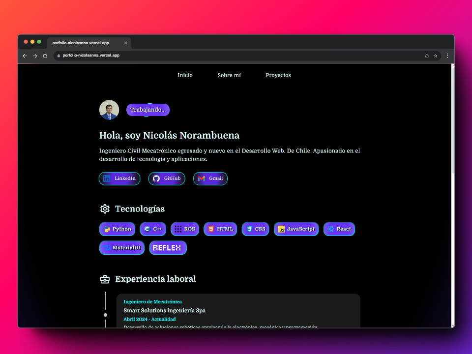

# Porfolio Web


<p align="center" width="100%">
    <a href="https://porfolio-nicolasnna.vercel.app"></a>
    
</p>

<p align="center">
Porfolio Web propio desarrollado con React + Vite. 
</p>

# Caracteristicas

* Desarrollado con React + Vite.
* Página *responsive* adapatado para móviles.
* Fácil actualización del contenido modificando el archivo `data.json`.

# Ejecución local

1. Clonar este repositorio:
   ```
   git clone https://github.com/nicolasnna/porfolio-web-react
   ```
2. Ir al directorio e instalar lo necesario con npm (u otro gestor de paquetes):
    ```
    npm install
    ```
3. Ejecutar el entorno de desarrollador:
   ```
   npm run dev
   ``` 